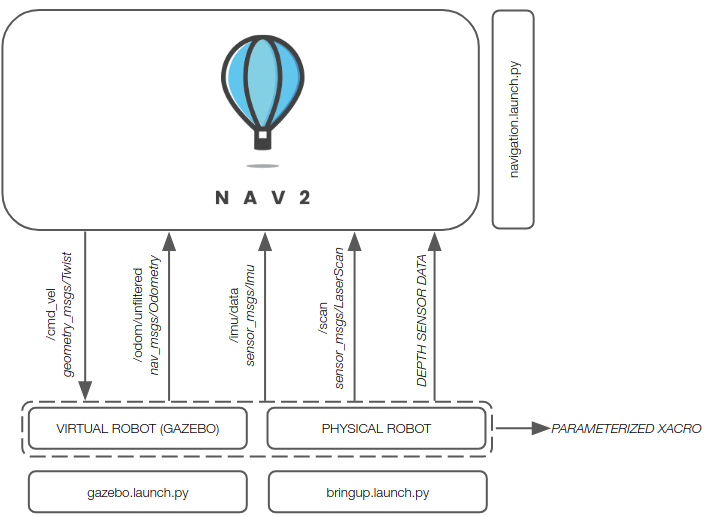
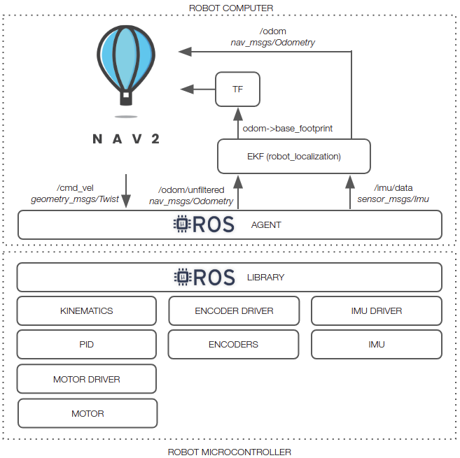

# linorobot2


linorobot2 is a ROS2 port of the [linorobot](https://github.com/linorobot/linorobot) package. If you're planning to build your own custom ROS2 robot (2WD, 4WD, Mecanum Drive) using accessible parts, then this package is for you. This repository contains launch files to easily integrate your DIY robot with Nav2 and a simulation pipeline to run and verify your experiments on a virtual robot in Gazebo. 

Once the robot's URDF has been configured in linorobot2_description package, users can easily switch between booting up the physical robot and spawning the virtual robot in Gazebo. 



Assuming you're using one of the tested sensors, linorobot2 automatically launches the necessary hardware drivers, with the topics being conveniently matched with the topics available in Gazebo. This allows users to define parameters for high level applications (ie. Nav2 SlamToolbox, AMCL) that are common to both virtual and physical robots.

The image below summarizes the topics available after running **bringup.launch.py**.


An in-depth tutorial on how to build the robot is available in [linorobot2_hardware](https://github.com/linorobot/linorobot2_hardware).

## Installation 
This package requires ros-foxy or ros-galactic. If you haven't installed ROS2 yet, you can use this [installer](https://github.com/linorobot/ros2me) script that has been tested to work on x86 and ARM based dev boards ie. Raspberry Pi4/Nvidia Jetson Series. 

### 1. Robot Computer - linorobot2 Package
The easiest way to install this package on the robot computer is to run the bash script found in this package's root directory. It will install all the dependencies, set the ENV variables for the robot base and sensors, and create a linorobot2_ws (robot_computer_ws) on the robot computer's `$HOME` directory. If you're using a ZED camera with a Jetson Nano, you must create a custom Ubuntu 20.04 image for CUDA and the GPU driver to work. Here's a quick [guide](./ROBOT_INSTALLATION.md#1-creating-jetson-nano-image) on how to create a custom image for Jetson Nano.

    source /opt/ros/<ros_distro>/setup.bash
    cd /tmp
    wget https://raw.githubusercontent.com/linorobot/linorobot2/${ROS_DISTRO}/install_linorobot2.bash
    bash install_linorobot2.bash <robot_type> <laser_sensor> <depth_sensor>
    source ~/.bashrc

robot_type:
- `2wd` - 2 wheel drive robot.
- `4wd` - 4 wheel drive robot.
- `mecanum` - Mecanum drive robot.

laser_sensor:
- `rplidar` - [RP LIDAR A1](https://www.slamtec.com/en/Lidar/A1)
- `ldlidar` - [LD06 LIDAR](https://www.inno-maker.com/product/lidar-ld06/)
- `ydlidar` - [YDLIDAR](https://www.ydlidar.com/lidars.html)
- `xv11` - [XV11](http://xv11hacking.rohbotics.com/mainSpace/home.html)
- `realsense` - * [Intel RealSense](https://www.intelrealsense.com/stereo-depth/) D435, D435i
- `zed` - * [Zed](https://www.stereolabs.com/zed)
- `zed2` - * [Zed 2](https://www.stereolabs.com/zed-2)
- `zed2i` - * [Zed 2i](https://www.stereolabs.com/zed-2i)
- `zedm` - * [Zed Mini](https://www.stereolabs.com/zed-mini) 
- `-` - If the robot's sensor is not listed above.

Sensors marked with an asterisk are depth sensors. If a depth sensor is used as a laser sensor, the launch files will run [depthimage_to_laserscan](https://github.com/ros-perception/depthimage_to_laserscan) to convert the depth sensor's depth image to laser scans.

depth_sensor:
- `realsense` - [Intel RealSense](https://www.intelrealsense.com/stereo-depth/) D435, D435i
- `zed` - [Zed](https://www.stereolabs.com/zed)
- `zed2` - [Zed 2](https://www.stereolabs.com/zed-2)
- `zed2i` - [Zed 2i](https://www.stereolabs.com/zed-2i)
- `zedm` - [Zed Mini](https://www.stereolabs.com/zed-mini)
- `oakd` - [OAK D](https://shop.luxonis.com/collections/oak-cameras-1/products/oak-d)
- `oakdlite` - [OAK D Lite](https://shop.luxonis.com/collections/oak-cameras-1/products/oak-d-lite-1)
- `oakdpro` - [OAK-D Pro](https://shop.luxonis.com/collections/oak-cameras-1/products/oak-d-pro)


Alternatively, follow this [guide](./ROBOT_INSTALLATION.md) to do the installation manually.

### 2. Host Machine / Development Computer - Gazebo Simulation (Optional)
This step is only required if you plan to use Gazebo later. This comes in handy if you want to fine-tune parameters (ie. SLAM Toolbox, AMCL, Nav2) or test your applications on a virtual robot. 

#### 2.1 Install linorobot2 Package
Install linorobot2 package on the host machine:

    cd <host_machine_ws>
    git clone -b $ROS_DISTRO https://github.com/linorobot/linorobot2 src/linorobot2
    rosdep update && rosdep install --from-path src --ignore-src -y --skip-keys microxrcedds_agent --skip-keys micro_ros_agent
    colcon build
    source install/setup.bash

* microxrcedds_agent and micro_ros_agent dependency checks are skipped to prevent this [issue](https://github.com/micro-ROS/micro_ros_setup/issues/138) of finding its keys. This means that you have to always add `--skip-keys microxrcedds_agent --skip-keys micro_ros_agent` whenever you have to run `rosdep install` on the ROS2 workspace where you installed linorobot2. 

#### 2.2 Define Robot Type
Set LINOROBOT2_BASE env variable to the type of robot base used. Available env variables are *2wd*, *4wd*, and *mecanum*. For example:

    echo "export LINOROBOT2_BASE=2wd" >> ~/.bashrc
    source ~/.bashrc

You can skip the next step (Host Machine - RVIZ Configurations) since this package already contains the same RVIZ configurations to visualize the robot. 

### 3. Host Machine - RVIZ Configurations
Install [linorobot2_viz](https://github.com/linorobot/linorobot2_viz) package to visualize the robot remotely specifically when creating a map or initializing/sending goal poses to the robot. The package has been separated to minimize the installation required if you're not using the simulation tools on the host machine.

    cd <host_machine_ws>
    git clone https://github.com/linorobot/linorobot2_viz src/linorobot2_viz
    rosdep update && rosdep install --from-path src --ignore-src -y 
    colcon build
    source install/setup.bash

## Hardware and Robot Firmware
All the hardware documentation and robot microcontroller's firmware can be found [here](https://github.com/linorobot/linorobot2_hardware).

## URDF
### 1. Define robot properties
[linorobot2_description](./linorobot2_description) package has parameterized xacro files that can help you kickstart writing the robot's URDF. Open <robot_type>.properties.urdf.xacro in [linorobot2_description/urdf](./linorobot2_description/urdf) directory and change the values according to the robot's specification/dimensions. All pose definitions must be measured from the `base_link` (center of base) and wheel positions (ie `wheel_pos_x`) are referring to wheel 1.

For custom URDFs, you can change the `urdf_path` in [description.launch.py](./linorobot2_description/launch/description.launch.py) found in linorobot2_description/launch directory. 

Robot Orientation:

--------------FRONT--------------

WHEEL1  WHEEL2  (2WD/4WD)

WHEEL3  WHEEL4  (4WD)

--------------BACK--------------

Build the robot computer's workspace to load the new URDF:

    cd <robot_computer_ws>
    colcon build

The same changes must be made on the host machine's <robot_type>.properties.urdf.xacro if you're simulating the robot in Gazebo. Remember to also build the host machine's workspace after editing the xacro file.

    cd <host_machine_ws>
    colcon build

### 2. Visualize the newly created URDF
#### 2.1 Publish the URDF from the robot computer:

    ros2 launch linorobot2_description description.launch.py

Optional parameters for simulation on host machine:
- **rviz** - Set to true to visualize the robot in rviz2 and only if you're configuring the URDF from the host machine. For example:

        ros2 launch linorobot2_description description.launch.py rviz:=true

#### 2.2 Visualize the robot from the host machine:

The `rviz` argument on description.launch.py won't work on headless setup but you can visualize the robot remotely from the host machine:

    ros2 launch linorobot2_viz robot_model.launch.py

## Quickstart
All commands below are to be run on the robot computer unless you're running a simulation or rviz2 to visualize the robot remotely from the host machine. SLAM and Navigation launch files are the same for both real and simulated robots in Gazebo.

### 1. Booting up the robot

#### 1.1a Using a real robot:

    ros2 launch linorobot2_bringup bringup.launch.py

Optional parameters:
- **base_serial_port** - Serial port of the robot's microcontroller. The assumed value is `/dev/ttyACM0`. Otherwise, change the default value to the correct serial port. For example:
    
    ```
    ros2 launch linorobot2_bringup bringup.launch.py base_serial_port:=/dev/ttyACM1
    ```
- **joy** - Set to true to run the joystick node in the background. (Tested on Logitech F710).

Always wait for the microROS agent to be connected before running any application (ie. creating a map or autonomous navigation). Once connected, the agent will print:

    | Root.cpp             | create_client     | create
    | SessionManager.hpp   | establish_session | session established

The agent needs a few seconds to get reconnected (less than 30 seconds). Unplug and plug back in the microcontroller if it takes longer than usual.

#### 1.1b Using Gazebo:
    
    ros2 launch linorobot2_gazebo gazebo.launch.py

linorobot2_bringup.launch.py or gazebo.launch.py must always be run on a separate terminal before creating a map or robot navigation when working on a real robot or gazebo simulation respectively.

### 2. Controlling the robot
#### 2.1  Keyboard Teleop
Run [teleop_twist_keyboard](https://index.ros.org/r/teleop_twist_keyboard/) to control the robot using your keyboard:

    ros2 run teleop_twist_keyboard teleop_twist_keyboard

Press:
- **i** - To drive the robot forward.
- **,** - To reverse the robot.
- **j** - To rotate the robot CCW.
- **l** - To rotate the robot CW.
- **shift + j** - To strafe the robot to the left (for mecanum robots).
- **shift + l** - To strafe the robot to the right (for mecanum robots).
- **u / o / m / .** - Used for turning the robot, combining linear velocity x and angular velocity z.

#### 2.2 Joystick
Pass `joy` argument to the launch file and set it to true to enable the joystick. For example:

    ros2 launch linorobot2_bringup bringup.launch.py joy:=true

- On F710 Gamepad, the top switch should be set to 'X' and the 'MODE' LED should be off.

Press Button/Move Joystick:
- **RB (First top right button)** - Press and hold this button while moving the joysticks to enable control.
- **Left Joystick Up/Down** - To drive the robot forward/reverse.
- **Left Joystick Left/Right** - To strafe the robot to the left/right.
- **Right Joystick Left/Right** - To rotate the robot CW/CCW.

### 3. Creating a map

#### 3.1 Run [SLAM Toolbox](https://github.com/SteveMacenski/slam_toolbox):


    ros2 launch linorobot2_navigation slam.launch.py

Optional parameters for simulation on host machine:

For example:

    ros2 launch linorobot2_navigation slam.launch.py rviz:=true sim:=true

- **sim** - Set to true for simulated robots on the host machine. Default value is false.
- **rviz** - Set to true to visualize the robot in RVIZ. Default value is false.

#### 3.1 Run rviz2 to visualize the robot from host machine:
The `rviz` argument on slam.launch.py won't work on headless setup but you can visualize the robot remotely from the host machine:

    ros2 launch linorobot2_viz slam.launch.py

#### 3.2 Move the robot to start mapping

Drive the robot manually until the robot has fully covered its area of operation. Alternatively, the robot can also receive goal poses to navigate autonomously while mapping:

    ros2 launch nav2_bringup navigation_launch.py

- Pass `use_sim_time:=true` to the launch file when running in simulation.

More info [here](https://navigation.ros.org/tutorials/docs/navigation2_with_slam.html).

#### 3.3 Save the map

    cd linorobot2/linorobot2_navigation/maps
    ros2 run nav2_map_server map_saver_cli -f <map_name> --ros-args -p save_map_timeout:=10000.

### 4. Autonomous Navigation

#### 4.1 Load the map you created:

Open linorobot2/linorobot2_navigation/launch/navigation.launch.py and change *MAP_NAME* to the name of the newly created map. Build the robot computer's workspace once done:
    
    cd <robot_computer_ws>
    colcon build

Alternatively, `map` argument can be used when launching Nav2 (next step) to dynamically load map files. For example:

    ros2 launch linorobot2_navigation navigation.launch.py map:=<path_to_map_file>/<map_name>.yaml


#### 4.2 Run [Nav2](https://navigation.ros.org/tutorials/docs/navigation2_on_real_turtlebot3.html) package:

    ros2 launch linorobot2_navigation navigation.launch.py

Optional parameter for loading maps:
- **map** - Path to newly created map <map_name.yaml>.

Optional parameters for simulation on host machine:
- **sim** - Set to true for simulated robots on the host machine. Default value is false.
- **rviz** - Set to true to visualize the robot in RVIZ. Default value is false.

#### 4.3 Run rviz2 to visualize the robot from host machine:
The `rviz` argument for navigation.launch.py won't work on headless setup but you can visualize the robot remotely from the host machine:

    ros2 launch linorobot2_viz navigation.launch.py

Check out Nav2 [tutorial](https://navigation.ros.org/tutorials/docs/navigation2_on_real_turtlebot3.html#initialize-the-location-of-turtlebot-3) for more details on how to initialize and send goal pose. 

navigation.launch.py will continue to throw this error `Timed out waiting for transform from base_link to map to become available, tf error: Invalid frame ID "map" passed to canTransform argument target_frame - frame does not exist` until the robot's pose has been initialized.


## Troubleshooting Guide

#### 1. The changes I made on a file are not taking effect on the package configuration/robot's behavior.
- You need to build your workspace every time you modify a file:

    ```
    cd <ros2_ws>
    colcon build
    #continue what you're doing...
    ```

#### 2. [`slam_toolbox]: Message Filter dropping message: frame 'laser'`
- Try to up `transform_timeout` by 0.1 in linorobot2_navigation/config/slam.yaml until the warning is gone.


#### 3. `target_frame - frame does not exist`
- Check your <robot_type>.properties.urdf.xacro and ensure that there's no syntax errors or repeated decimal points.

#### 4. Weird microROS agent behavior after updating the Linux/ROS
- Don't forget to update the microROS agent as well after your updates. Just run:
    
    ```
    bash update_microros.bash
    ```

## Useful Resources:

https://navigation.ros.org/setup_guides/index.html

http://gazebosim.org/tutorials/?tut=ros2_overview
